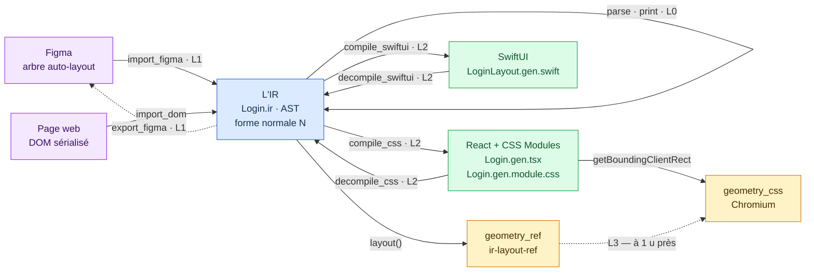
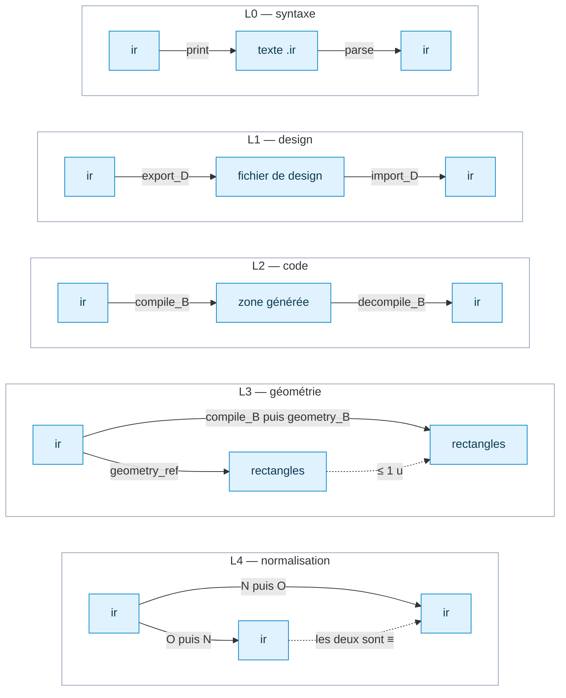
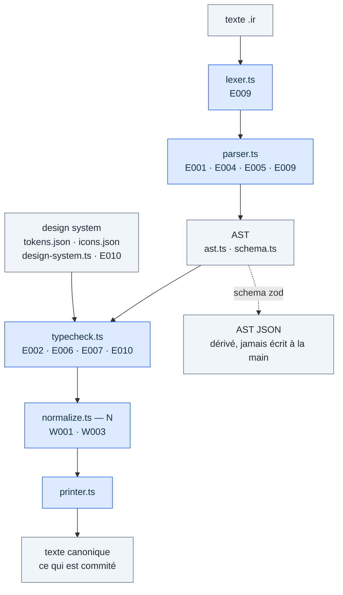
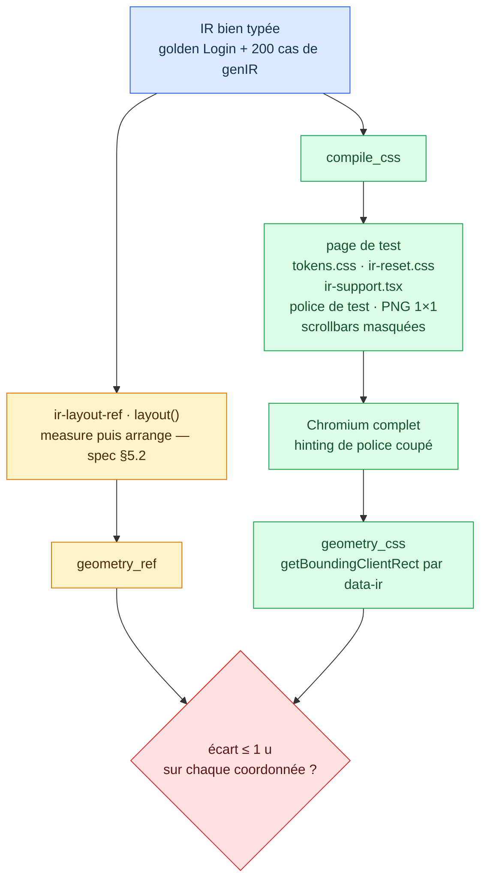
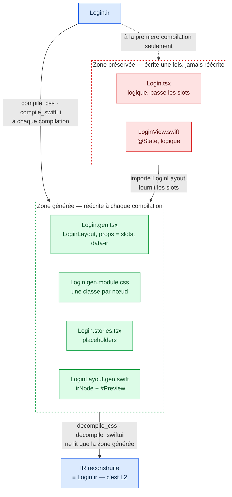
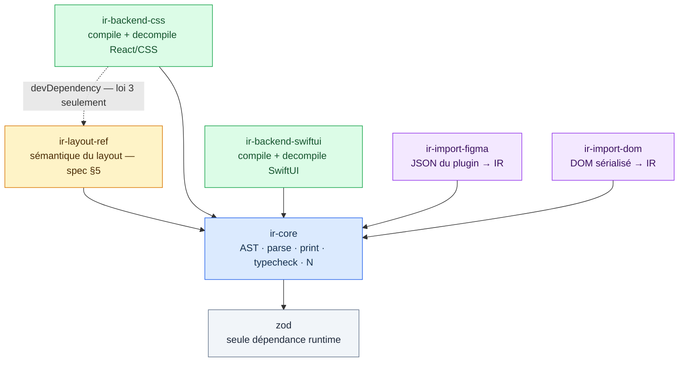

# Carte de l'architecture

Ce document est une **carte**, pas une décision. Il est dérivé des ADR (`docs/adr/`) et de la spec (`docs/spec-ir-v0.md`), qui gardent leur autorité : s'il les contredit, c'est lui qui a tort. Il décrit la structure du projet, jamais son avancement — ce qui est fait se lit dans la table d'état du README, et ce qui reste à faire dans `TASKS.md`.

Les diagrammes sont en Mermaid pour la même raison que l'IR est textuelle : une représentation qu'on lit dans un diff, qu'on versionne, et qu'aucun outil de dessin ne détient.

---

## 1. La carte d'ensemble

Trois mondes. Au centre, le langage ; à gauche, les outils de design ; à droite, le code. Le design et le code ne se parlent jamais directement : tout passe par l'IR (ADR-001). Les flèches portent le nom de leur fonction (spec §7) et, quand il y en a une, la loi qui les contraint.



Légende : bleu, l'IR et ce qui la manipule (`ir-core`) — violet, les artefacts extérieurs que le projet ne possède pas — vert, le code généré — ambre, les géométries, qui doivent tomber d'accord.

Ce qu'il faut y lire :

- **Le centre est un col.** Toute traduction passe par l'IR. Il n'existe aucune flèche Figma → React : ce serait un exporteur de plus, sans loi pour le contraindre (ADR-001).
- **Chaque aller-retour est une loi.** `parse`/`print` referment L0, `import`/`export` referment L1, `compile`/`decompile` referment L2. Un backend ou un importeur qui n'a que la moitié de son couple n'est pas testable — c'est pourquoi un décompilateur n'est pas une commodité mais la condition de l'oracle.
- **La forme normale est dans le nœud central, pas sur une flèche.** L4 dit que `N` commute avec toutes les autres opérations : toute comparaison, dans les lois comme dans les diffs, se fait sur `N(ir)`. C'est ce qui donne un sens à `≡`.
- **La géométrie est à part.** Elle n'est pas une projection de l'IR mais son *observation* : `ir-layout-ref` dit ce que le layout doit valoir, le backend dit ce qu'il vaut, et L3 exige qu'ils s'accordent à 1 u. Le côté SwiftUI est symétrique (XCTest et `GeometryReader` au lieu de Chromium et `getBoundingClientRect`) ; le §4 déplie le côté CSS, seul monté à ce jour.

**Note sur `export_figma`.** La loi 1 s'écrit `import_D(export_D(ir)) ≡ ir` et suppose donc un exporteur. Aucun package de la table de `CLAUDE.md` ne le porte : il n'y a que `ir-import-figma`, et T12 teste L1 « sur fixtures JSON, sans Figma ». La flèche est dessinée en pointillé parce que la loi la réclame ; le package qui la portera reste à nommer. À trancher avant T12, par un ADR ou une ligne de plus dans la table des packages — pas ici.

---

## 2. Les cinq lois

Les lois sont l'oracle du projet (spec §7). Quatre sont des allers-retours qui doivent être l'identité sur la forme normale ; L3 est une comparaison de deux mesures.



| Loi | Énoncé | Ce qu'elle démontre | Où vit son test |
|---|---|---|---|
| L0 | `parse(print(ir)) ≡ ir` | Le langage a une syntaxe, pas juste un format | `packages/ir-core/test/laws.test.ts` |
| L1 | `import_D(export_D(ir)) ≡ ir` | Le design ne perd rien de ce que l'IR exprime | chez l'importeur, sur des fixtures JSON, sans l'outil de design |
| L2 | `decompile_B(compile_B(ir)) ≡ ir` | Le code ne perd rien de ce que l'IR exprime | chez chaque backend : `packages/ir-backend-css/test/laws.test.ts` |
| L3 | `geometry_B(compile_B(ir)) ≈ geometry_ref(ir)` | Le compilateur est correct, pas seulement réversible | chez chaque backend : `packages/ir-backend-css/test/geometry/law3.test.ts` |
| L4 | `N∘N = N`, et `N` commute avec import, export, compile, decompile | Toute comparaison a un sens unique | `packages/ir-core/test/laws.test.ts` pour l'idempotence, le `laws.test.ts` de chaque backend pour la commutation |

Les propriétés du layout de référence lui-même — terminaison, absence de NaN, non-chevauchement des frères, un Stack `hug` qui contient ses enfants — sont dans `packages/ir-layout-ref/test/laws.test.ts`. Elles ne sont pas des lois de l'adjonction ; elles vérifient que l'oracle de L3 est lui-même sain.

**Ce qui n'est pas une loi** et ne doit jamais être testé comme tel (spec §7) : `export_D(import_D(x)) = x` pour un fichier de design quelconque, et `compile_B(decompile_B(c)) = c` pour un code quelconque. Ces deux sens perdent par construction — c'est la définition d'une adjonction (ADR-002).

---

## 3. Le pipeline de `ir-core`, et où naît chaque erreur

Un fichier `.ir` traverse toujours les mêmes étapes. Chaque étape ne peut émettre que certains codes (spec §12, colonne « Où ») ; les erreurs sont des valeurs typées, jamais des exceptions.



Ce qu'il faut y lire :

- **Le typecheck a besoin du design system.** Sans lui, on ne peut pas savoir qu'un `$color.text.primary` existe ni qu'il est référençable. C'est pourquoi `E002` naît là et pas au parse.
- **`N` vient après le typecheck, jamais avant.** `N` est totale sur un AST bien typé (spec §6) : elle ne peut pas échouer, elle rend l'arbre normalisé et ses avertissements.
- **`print` ne normalise pas.** Le texte commité est `print(N(parse(s)))`, en trois temps. C'est exactement l'énoncé de L0.
- **Le JSON est dérivé.** Il est produit par `parse` et validé par les schémas zod, jamais édité à la main (ADR-006).

Les codes qui naissent hors de `ir-core` sont posés sur les nœuds correspondants du §1 : `E003` (construction non représentable) au décompilateur et aux importeurs, `E008` (frames de breakpoints différentes) aux importeurs, `W002` (valeur arrondie) au mode tolérant de l'import Figma. `E002` et `E010` reviennent aussi dans les backends, qui relisent le design system pour compiler les tokens.

---

## 4. La loi 3 en détail

C'est le seul endroit du projet où deux implémentations indépendantes doivent tomber d'accord sur un nombre. À gauche, la sémantique de référence en fonctions pures ; à droite, un vrai navigateur.



Le « à mesure de texte fixée » de la loi n'est pas une clause de style : c'est ce que le harnais construit. Quatre substitutions lui appartiennent, et pas au compilateur (spec §8.3) :

1. **La police.** Une police de test dont chaque glyphe avance exactement 0,6 em — la valeur de `monospaceMeasure` (`packages/ir-layout-ref/src/measure-text.ts`). Le navigateur et la référence mesurent donc le même texte de la même façon.
2. **Le hinting.** Chromium **complet**, jamais le *headless shell* de Playwright, lancé avec `--font-render-hinting=none`. Un rendu hinté arrondit l'avance des glyphes au pixel entier et la géométrie glisse avec la longueur du texte ; un test dédié (`metrics.test.ts`) vérifie ce point avant le corpus, pour que cette dérive se lise comme telle et non comme un écart de layout.
3. **Les images.** Le `src` devient un PNG 1×1 transparent : l'asset n'est pas dans l'IR, la référence lui donne une taille intrinsèque nulle et aucun axe n'en dépend (spec §4.5).
4. **Les barres de défilement.** Masquées, le modèle de référence n'en ayant pas.

C'est cette loi qui a trouvé ADR-010 (la bordure est décorative, elle ne prend pas de place) et ADR-011 (`hug` sur un Text est la largeur sans repli, bornée par l'espace offert), en montrant qu'un backend ne pouvait pas satisfaire la spec telle qu'elle était écrite.

---

## 5. Les deux zones d'un écran compilé

Conséquence directe d'ADR-002 : le code généré est coupé en deux, syntaxiquement. La zone générée contient exactement le fragment design-relevant et est réécrite à chaque compilation ; la zone préservée contient la logique et n'est jamais réécrite après sa création.



L'invariant qui rend L2 possible tient en une phrase : **la décompilation ne lit que la zone générée**. Elle ne voit jamais `Login.tsx`, donc la logique qu'on y écrit ne peut pas casser une loi, et le compilateur ne peut pas l'écraser.

Certains fichiers ne sont dans aucune des deux zones parce qu'ils ne dépendent d'aucun écran : ils sont écrits une fois par projet. `ir-support.tsx` fournit `Icon` (sprite SVG, noms `web` d'`icons.json`) et le type `ImageSource` (ADR-009) ; `ir-reset.css`, chargé avant `tokens.css`, pose le modèle de boîtes que suppose la zone générée (`box-sizing: border-box`, marges et bordures d'agent utilisateur à zéro) ; `tokens.css` et `Tokens.swift` sont compilés depuis le design system (T5), pas depuis un écran.

`decompile_css` est un parsing de forme, pas une analyse sémantique : le nom de l'écran vient du module CSS importé, l'arbre de l'imbrication des éléments, le type de la balise et de `display: flex`, les propriétés des déclarations de la règle du même `data-ir`. Tout ce qui sort de ces formes est `E003`, avec le chemin du nœud — jamais une devinette (spec §9.1).

---

## 6. Le dépôt

Six packages. Une flèche va du dépendant vers sa dépendance.



`ir-core` et `ir-layout-ref` sont en fonctions pures, sans I/O. `ir-core` n'a que `zod` en dépendance runtime, et `fast-check` en peer optionnelle pour son générateur `genIR` (`src/testing/`), qu'il offre aux autres packages pour leurs tests de propriétés. `ir-backend-css` ne dépend de `ir-layout-ref` qu'en devDependency : c'est la loi 3 qui les met en présence, pas la compilation.

```
docs/            spec, ADR, cette carte
examples/        Login.ir et ses sorties golden : code compilé, géométrie de référence
fixtures/        design system minimal (DTCG) et sorties attendues du compilateur de tokens
packages/        ir-core, ir-layout-ref, backends, importeurs
```

La CI (`.github/workflows/ci.yml`) a deux tâches :

| Tâche | Ce qu'elle lance | Pourquoi elle est à part |
|---|---|---|
| `check` | matrice sur Node LTS : `typecheck`, `lint`, `format:check`, `test` | — |
| `geometry` | `pnpm test:geometry`, après l'installation de Chromium par Playwright | la loi 3 demande un navigateur |

Le markdown, la spec, les fixtures et les exemples sont dans `.prettierignore` : ils s'écrivent à la main et ne sont jamais reformatés — cette carte comprise.
